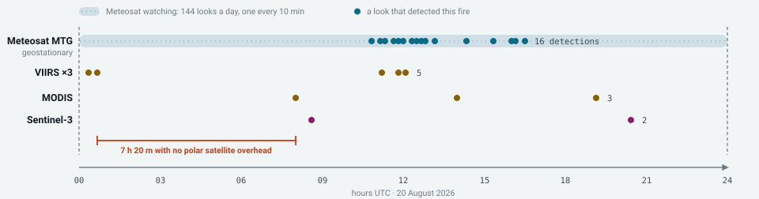

# FireWatch Zavidovići

### 🔥 [Live map](https://mirza-basic.github.io/firewatch) · 📖 [Documentation](https://mirza-basic.github.io/firewatch/docs/)

Near-live wildfire monitoring for **Grad (opština) Zavidovići** — 560 km² of mostly forest
in central Bosnia. Three satellite feeds, clustered into tracked fires, alerting by SMS in
Bosnian and drawing a map that updates itself.

Nothing here is specific to Zavidovići: point it at your own municipality and it runs
there instead, on GitHub Actions and Pages, which for a public repository costs nothing.

## Why

Nobody watches 560 km² of forest at three in the morning. Satellites do, and the data is
free — but the fire products built on it are published for science, not to warn anybody.
**Knowing a forest is burning eleven hours late is history, not warning.**

Two delays cause that, and they add up. First, the satellites sharp enough to catch a
small fire pass overhead only a few times a day. Second, being seen is not being told:
the observation must be downlinked, processed and published before anything can poll it.



*20 August 2026, a fire 18 km south-east of town. Meteosat took 144 looks and found it in
16; the polar satellites managed ten between them, and none was overhead between 00:41
and 08:01. In eight months of records, no polar detection has ever landed between 02:00
and 07:00 UTC — those crossing times are near-fixed, so that window is empty every night.*

End to end, that puts Meteosat about **39 minutes** behind ignition and FIRMS about
**200 minutes** at best — 11 hours at worst, when an overnight gap is followed by hours of
processing. The floor is ~35 minutes, set by EUMETSAT, and nothing in this code improves
on it. What it can do is make sure the alert arrives at 35 minutes rather than at eleven
hours.

## What it does

Every cycle it fetches three feeds, keeps what falls inside the municipality, folds the
detections into tracked fire events, works out what changed, and tells you.

| Feed | Resolution | Cadence | Latency | Brings |
|---|---|---|---|---|
| Meteosat MTG FRP | ~4 km | **10 min** | ~25 min | continuity — it is watching at 3am |
| VIIRS + MODIS (FIRMS) | 375 m / 1 km | 4–7 / day | ~3 h | sensitivity to small fires |
| Sentinel-3 SLSTR FRP | 1 km | ~2 / day | 1–3 h | extra passes, corroboration |

They fail in opposite directions, which is the whole reason for carrying all three.
Meteosat never stops looking but needs roughly 5 MW before a 4 km pixel registers
anything; the polar sensors will find a 1 MW fire but are usually somewhere else. Only
Meteosat and Sentinel-3 need no account at all.

Clustering is what makes an alert mean something: one fire produces one detection per
sensor, per overpass, per hot pixel, and the 20 August fire produced **45 detections from
three satellites over 30 hours**. Clustered, that is one event with a stable identity, a
location in words, and a history you can watch grow:

```
NOVI POZAR: 5.6 km I od Kamenice          fire, 5.6 km east of Kamenica
VISOK 1.9/1.9MW                           severity, peak/latest radiative power
44.329,18.278                             coordinates that work with no signal
Vjetar 14km/h SI vlaga 38% rizik povisen  wind, humidity, spread risk
https://mirza-basic.github.io/firewatch   the live map
```

Alerts are written in Bosnian and transliterated to ASCII so they stay inside one
160-character SMS segment — measured at at most 153 characters across every stored event
and alert kind.

**What it is not.** These are satellite *thermal anomalies*, not confirmed wildfires:
industrial heat, flares and agricultural burning all register, so verify before acting.
Cloud blocks every one of these sensors. Small fires are invisible to the fast feed. And
for a fire near people, a phone call still beats every satellite here by hours — this is
for the forest nobody is looking at.

## How it works

One fixed chain per cycle. Understanding it is most of understanding the codebase.


Two decisions in there drive everything else.

**Novelty is a property of the database, not a payload diff.** Every detection gets a
deterministic id from its source, sensor, rounded position and timestamp, and "what is
new" is whatever `INSERT OR IGNORE` actually inserted. A detection re-reported across
polls, or seen by two satellites, is only ever new once.

**Alerting operates on clustered events, never on raw detections.** Single linkage in
space and time, 3.5 km and 8 hours. The radius is set by Meteosat's ~4 km pixel; tighten
it below about 3.5 km and one geostationary fire splits into several events.


| Alert | Trigger | |
|---|---|---|
| `new` | a fire never reported before | SMS |
| `intensified` | peak power up ≥1.5× and ≥3 MW | SMS |
| `grew` | more detections **and** footprint wider by ≥0.5 km | SMS |
| `reignited` | a quiet event is producing detections again | SMS |
| `corroborated` | a second independent satellite now sees it | notification |
| `extinguished` | nothing for `quiet_hours` | silent |

Each event and kind is rate-limited to one alert per 25 minutes.

`active` is a single line of code and a claim about the data: the newest detection in the
cluster is younger than `quiet_hours` (5). It is recomputed every cycle, so no status is
stored and none can get stuck. What it asserts is that *a satellite still reports heat*,
not that the fire is out — which is why `extinguished` is silent. It is news about the
feed, not about the forest.

## How it runs on GitHub

No server, no container, and no scheduler of GitHub's own. The production system is two
files in `.github/workflows/`, and this repository is the running instance.


Three things explain the shape of it:

**The repository is the disk.** A runner keeps nothing, so `state/firewatch.db` is
committed back at the end of each cycle. That database carries the record of what has
already been alerted on, so a failed push is not cosmetic — the next run rediscovers the
same fire and texts about it again. The commit is gated on the detection count rather than
the file's bytes, or every run would add a fresh 188 KB blob carrying no new information.

**A Pages deploy replaces the whole site.** The map lives at `/` and the documentation is
built into `/docs/` in the same run, because a deploy carrying only the docs would take
the map — the URL inside every SMS — off the air.

**There is no `schedule:` block.** GitHub's cron has a five-minute floor and drifts 5–30
minutes under load, so an external timer calls the dispatch API instead, on whatever
cadence you choose. The cost is that GitHub can no longer tell you it stopped: if the
caller dies there is no failed run, just a map that quietly stops updating. Watch the
timestamp on the map, not the Actions tab.

## Run it yourself

See it work first — no account, no key, no deployment, because two of the three feeds need
no credentials:

    git clone https://github.com/mirza-basic/firewatch.git
    cd firewatch
    python3 -m pip install -r requirements.txt      # requests + certifi
    python3 -m firewatch poll                       # a real cycle, printed
    python3 -m firewatch map                        # opens the map it just built

To run it for your own town: fork, then set four repository secrets
(`FIRMS_MAP_KEY`, `HTTPSMS_API_KEY`, `HTTPSMS_FROM`, `FIREWATCH_SMS_TO` — recipients are a
secret because a public repo would publish the numbers), set **Workflow permissions** to
read/write and **Pages source** to *GitHub Actions*, put your own Pages URL in
`FIREWATCH_PUBLIC_URL` in **both** workflow files, run `poll` once from the Actions tab,
then point a cron service at:

    POST https://api.github.com/repos/<you>/<repo>/actions/workflows/poll.yml/dispatches
    {"ref":"main"}

Ten to fifteen minutes is the sweet spot; faster buys nothing against a feed that
publishes every ten. One caveat worth checking before you start: Meteosat sees roughly
**60°W to 60°E**. Outside that arc everything still works, but you lose the fast feed and
alerts arrive around three hours late instead of forty minutes.

Repointing the boundary, the settlements and the language is walked through end to end in
the [documentation](https://mirza-basic.github.io/firewatch/docs/), which also covers
every command, every setting, and the failures that are silent.

## Commands

    python3 -m firewatch poll [range]       one cycle + a printed report
    python3 -m firewatch status [range]     last published state
    python3 -m firewatch map                rebuild and open the HTML map
    python3 -m firewatch backfill [days]    deep history fetch (default 30)
    python3 -m firewatch quota              FIRMS usage (a free call)
    python3 -m firewatch test-sms
    python3 tests_events.py                 clustering + alert-logic tests

`[range]` is `24h | 3d | 7d | 30d | 1y`, rolling windows over stored history — free of API
traffic, but only as deep as what has been stored, so run `backfill` once for the long
views. Python 3.14 is what the workflow runs.

## Layout

    .github/workflows/  poll.yml (the cycle) · test-sms.yml (a manual delivery check)
    firewatch/          sources · geo · store · events · enrich · notify · sms ·
                        mapgen · poller · config
    data/               boundary (OSM rel. 2528292), the 2 km band, 413 settlements
    deploy/             build-site.py, extract-diagrams.py, probe-mtg-night.py
    docs/               the published documentation, and the README's diagrams
    state/              the committed database — on a runner, this is the disk

`data/*` are build-time artifacts committed to the repo, so Nominatim and Overpass are
never called at runtime. The diagrams above are extracted from the documentation by
`python3 deploy/extract-diagrams.py`, so the two cannot drift apart. No credential is
committed: the FIRMS key comes from the environment, which is what a repository secret
becomes inside a run.

## License

[MIT](LICENSE) — fork it, run it, change it, no permission needed. Boundary and settlement
data © OpenStreetMap contributors under ODbL 1.0; detections courtesy of NASA FIRMS
(LANCE/ESDIS) and EUMETSAT; weather from Open-Meteo.

If you stand one up for your own municipality, open an issue — knowing which towns are
watched is more useful than a star.
