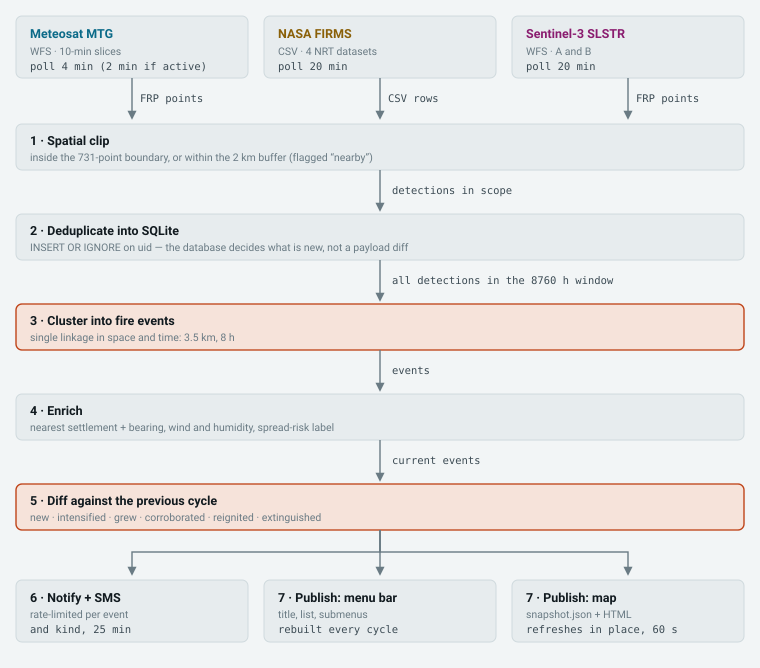
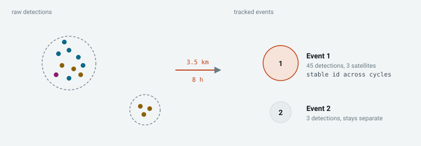
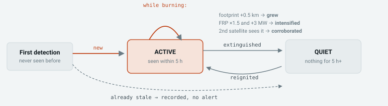
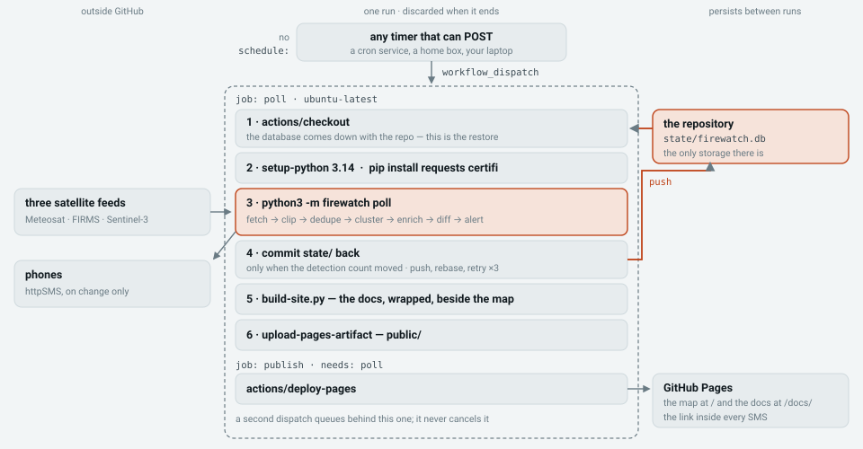

# FireWatch Zavidovići

### 🔥 [Live map](https://mirza-basic.github.io/firewatch) · 📖 [Documentation](https://mirza-basic.github.io/firewatch/docs/)

Near-live wildfire monitoring for **Grad (opština) Zavidovići** — 560 km² of mostly forest
in central Bosnia. Three satellite feeds, clustered into tracked fires, alerting by SMS in
Bosnian and drawing a map that updates itself.

Nothing here is specific to Zavidovići: point it at your own municipality and it runs
there instead, on GitHub Actions and Pages, which for a public repository costs nothing.

## Why

A fire that starts in 560 km² of forest at two in the morning is nobody's problem until
somebody sees smoke. Satellites see it sooner and the data is free — but the feeds are
built to archive fires, not to raise an alarm, and two delays stack up. The satellites
sharp enough to catch a small fire pass overhead only a few times a day. And being seen is
not being told: each observation has to be downlinked, processed into a fire product and
published before anything can poll it, which for NASA's feed takes about three hours.

Wait on that alone and a fire can reach you **eleven hours** after it started — an
overnight gap, then the processing. By then it is history, not a warning.


*3–4 September 2026, a fire 2.1 km south of Suha; night is shaded. **Detection does not
stop at sunset** — thermal infrared needs no daylight. Meteosat caught this one at 18:40
UTC after dark, Sentinel-3 twice at 20:01, and VIIRS eleven times between 00:41 and 01:45
while it burned at 1.3–3.0 MW. The single real gap is the 6 h 13 m before dawn: it lines up
with the 04–07 UTC window in which no polar satellite crosses this latitude, and Meteosat
could not fill it because the fire was well under its floor. The band underneath is
measured over this municipality's whole history to September 2026 — 133 VIIRS detections,
49 Meteosat, 8 each from MODIS and Sentinel-3 — so read the two 1 km figures as indicative
rather than settled.*

End to end, that puts Meteosat about **39 minutes** behind ignition and FIRMS about
**200 minutes** at best — 11 hours at worst, when an overnight gap is followed by hours of
processing. The ~35-minute floor is EUMETSAT's publishing latency and nothing here can
improve on it; on the hosted copy a 10–15 minute trigger puts you **30–45 minutes** behind
the flame front. The point was never 35 minutes instead of 39. It is 35 instead of
eleven hours.

## What it does

Every cycle it fetches three feeds, keeps what falls inside the municipality, folds the
detections into tracked fire events, works out what changed, and tells you.

| Feed | Resolution | Cadence | Latency | Brings |
|---|---|---|---|---|
| Meteosat MTG FRP | ~4 km | **10 min** | ~25 min | continuity — it is watching at 3am |
| VIIRS + MODIS (FIRMS) | 375 m / 1 km | 4–7 / day | ~3 h | sensitivity to small fires |
| Sentinel-3 SLSTR FRP | 1 km | ~2 / day | 1–3 h | extra passes, corroboration |

They fail in opposite directions, which is the whole reason for carrying all three.
Meteosat never stops looking, but the weakest fire it has ever reported here is 4.4 MW,
because a fire warms only the part of a 4 km pixel it lands in; VIIRS has caught one of
**0.19 MW** from 375 m, and is usually somewhere else when you need it. Meteosat's night
watch is not a figure of speech: asked for one five-hour window of local solar night, it
returned 1,951 detections over the Persian Gulf's gas flares and 43 over wildfires in
Iberia. Only Meteosat and Sentinel-3 need no account at all.

Clustering is what makes an alert mean something: one fire produces one detection per
sensor, per overpass, per hot pixel, and one fire here in August produced **45 detections from
three satellites over 30 hours**. Clustered, that is one event with a stable identity, a
location in words, and a history you can watch grow:

```
NOVI POZAR: 5.6 km I od Kamenice          fire, 5.6 km east of Kamenica
NIZAK 1.9/1.9MW                           severity, peak/latest radiative power
44.329,18.278                             coordinates that work with no signal
Vjetar 14km/h SI vlaga 38% rizik povisen  wind, humidity, spread risk
https://mirza-basic.github.io/firewatch   the live map
```

Alerts are written in Bosnian and transliterated to ASCII so they stay inside one
160-character SMS segment — measured at at most 153 characters across every stored event
and alert kind.

**What it is not.** These are satellite *thermal anomalies*, not confirmed wildfires:
industrial heat, flares and agricultural burning all register, so verify before acting.
Cloud blocks every one of these sensors. Small fires are invisible to the fast feed. And
for a fire near people, a phone call still beats every satellite here by hours — this is
for the forest nobody is looking at.

## How it works

One fixed chain per cycle. Understanding it is most of understanding the codebase.



Two decisions in there drive everything else.

**Novelty is a property of the database, not a payload diff.** Every detection gets a
deterministic id from its source, sensor, rounded position and timestamp, and "what is
new" is whatever `INSERT OR IGNORE` actually inserted. A detection re-reported across
polls, or seen by two satellites, is only ever new once.

**Alerting operates on clustered events, never on raw detections.** Single linkage in
space and time, 3.5 km and 8 hours.



The radius is set by Meteosat's ~4 km pixel: tighten it below 3.5 km and one geostationary
fire splits into several events, each alerting separately. The colours are the point — one
fire arriving from three sensors at three resolutions, recognised as one thing.



| Alert | Trigger | |
|---|---|---|
| `new` | a fire never reported before | SMS |
| `intensified` | peak power up ≥1.5× and ≥3 MW | SMS |
| `grew` | more detections **and** footprint wider by ≥0.5 km | SMS |
| `reignited` | a quiet event is producing detections again | SMS |
| `corroborated` | a second independent satellite now sees it | log only |
| `extinguished` | nothing for `quiet_hours` | silent |

Each event and kind is rate-limited to one alert per 25 minutes. Only the four SMS kinds
reach anybody on a runner: there is no desktop to notify, so `corroborated` lands in the
log and `extinguished` is deliberately silent.

`active` is one line of code and a claim about the data: the newest detection in the
cluster is younger than `quiet_hours` (5), recomputed every cycle so no status can get
stuck. It asserts that *a satellite still reports heat*, not that the fire is out — which
is why `extinguished` is silent. It is news about the feed, not about the forest.

## How it runs on GitHub

No server, no container, and no scheduler of GitHub's own. The production system is two
files in `.github/workflows/`, and this repository is the running instance.



Three things explain the shape of it:

**The repository is the disk.** A runner keeps nothing, so `state/firewatch.db` is
committed back each cycle. It carries the record of what has already been alerted on, so a
failed push is not cosmetic — the next run rediscovers the same fire and texts about it
again. The commit is gated on the detection count, not the file's bytes, or every run
would add a fresh 188 KB blob carrying nothing new.

**A Pages deploy replaces the whole site.** The map lives at `/` and the documentation is
built into `/docs/` in the same run, because a deploy carrying only the docs would take
the map — the URL inside every SMS — off the air.

**There is no `schedule:` block.** GitHub's cron has a five-minute floor and drifts 5–30
minutes under load, so an external timer calls the dispatch API instead, on whatever
cadence you choose. The cost is that GitHub can no longer tell you it stopped: if the
caller dies there is no failed run, just a map that quietly stops updating. Watch the
timestamp on the map, not the Actions tab.

## Run it yourself

See it work first — no account, no key, no deployment, because two of the three feeds need
no credentials:

    git clone https://github.com/mirza-basic/firewatch.git
    cd firewatch
    python3 -m pip install -r requirements.txt      # requests + certifi
    python3 -m firewatch poll                       # a real cycle, printed
    python3 -m firewatch map                        # opens the map it just built

To run it for your own town: fork it and **keep it public** — a private repo bills Actions
minutes and needs a paid plan for Pages. Set four repository secrets: `FIRMS_MAP_KEY`
([free, arrives in seconds](https://firms.modaps.eosdis.nasa.gov/api/map_key/), and
optional — without it the other two feeds carry the cycle), `HTTPSMS_API_KEY`,
`HTTPSMS_FROM`, and `FIREWATCH_SMS_TO`, recipients being a secret because a public repo
would publish the numbers. Set **Workflow permissions** to read/write and **Pages source**
to *GitHub Actions*, put your Pages URL in `FIREWATCH_PUBLIC_URL` in **both** workflow
files, run `poll` once from the Actions tab, then point a cron service at:

    POST https://api.github.com/repos/<you>/<repo>/actions/workflows/poll.yml/dispatches
    Authorization: Bearer <token>      # fine-grained PAT, Actions: read and write
    Accept: application/vnd.github+json

    {"ref":"main"}                     # required: an empty body is 422, success is 204

Ten to fifteen minutes is the sweet spot; faster buys nothing against a feed that
publishes every ten. One caveat worth checking before you start: Meteosat sees roughly
**60°W to 60°E**. Outside that arc everything still works, but you lose the fast feed and
alerts arrive around three hours late instead of forty minutes.

**Then give it your own geography.** Every detection is clipped against Zavidovići's
outline, so a fork left alone watches Bosnia whoever owns it. Three files in `data/` define
the place — build-time artifacts you generate once locally and commit, so Nominatim and
Overpass are never called at runtime:

| File | What it is | How you get it |
|---|---|---|
| `zavidovici.geojson` | the **municipality polygon** — a 731-point outline every detection is tested against | Nominatim, searching the *administrative* name ("Općina Kakanj", not "Kakanj") for the boundary relation |
| `zavidovici-buffer.geojson` | the **2 km buffer polygon**, drawn as the dashed band and used to flag fires just over the border | `python3 -m firewatch buffer` — the one command needing `shapely` and `pyproj` |
| `settlements.json` | 413 named places, which turn coordinates into "7.0 km ESE of Kamenica" | Overpass, within a radius wider than the municipality |

Then four constants in `firewatch/config.py` point at them — `BOUNDARY_GEOJSON`,
`BUFFER_GEOJSON`, `SETTLEMENTS_JSON`, and `TOWN_LAT`/`TOWN_LON`, the town centre every
"of town" distance and bearing is measured from. Delete `state/firewatch.db` too, or you
inherit Bosnia's fire history.

Two of those steps fail silently, which is why the written procedure is worth following:
change the buffer without rebuilding the polygon and the map omits the band rather than
drawing it wrong, and an Overpass regional mirror can return an empty settlement list,
leaving every fire labelled by bare coordinates. Both are covered, with the scripts, in
**[Point it at your municipality](https://mirza-basic.github.io/firewatch/docs/firewatch-fork.html#place)**
— run end to end against a neighbouring municipality: a 601-vertex boundary, 506
settlements, and a clip that accepted the town centre and rejected a point 30 km away. The
[field manual](https://mirza-basic.github.io/firewatch/docs/firewatch-field-manual.html#relocate)
has every command and every setting.

## Commands

    python3 -m firewatch poll [range]       one cycle + a printed report
    python3 -m firewatch status [range]     last published state
    python3 -m firewatch map                rebuild and open the HTML map
    python3 -m firewatch backfill [days]    deep history fetch (default 30)
    python3 -m firewatch quota              FIRMS usage (a free call)
    python3 -m firewatch test-sms
    python3 tests_events.py                 clustering + alert-logic tests

`[range]` is `24h | 3d | 7d | 30d | 1y` — rolling windows over stored history, free of API
traffic but only as deep as what is stored, so run `backfill` once. Python 3.14 in CI.

## Layout

    .github/workflows/  poll.yml (the cycle) · test-sms.yml (a manual delivery check)
    firewatch/          sources · geo · store · events · enrich · notify · sms ·
                        mapgen · poller · config
    data/               boundary (OSM rel. 2528292), the 2 km band, 413 settlements
    deploy/             build-site.py, extract-diagrams.py, two feed probes,
                        and the container + host files this README does not cover
    docs/               the published documentation, and the README's diagrams
    state/              the committed database — on a runner, this is the disk

The diagrams above are extracted from the documentation pages by
`python3 deploy/extract-diagrams.py`, so the two cannot drift apart. No credential is
committed: the FIRMS key comes from the environment, which is what a repository secret
becomes inside a run.

## License

[MIT](LICENSE) — fork it, run it, change it, no permission needed. Boundary and settlement
data © OpenStreetMap contributors under ODbL 1.0; detections courtesy of NASA FIRMS
(LANCE/ESDIS) and EUMETSAT; weather from Open-Meteo.

If you stand one up for your own municipality, open an issue — knowing which towns are
watched is more useful than a star.
