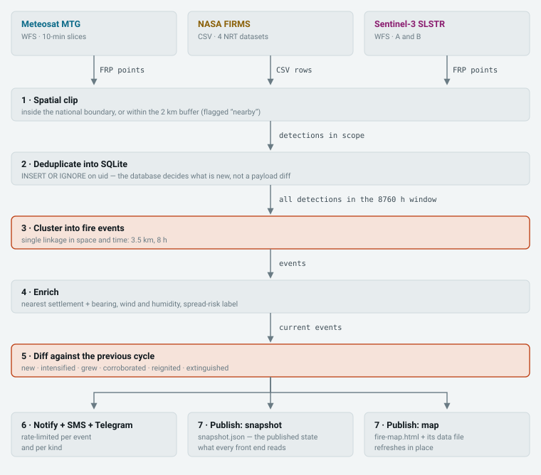
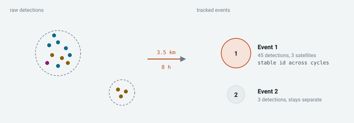
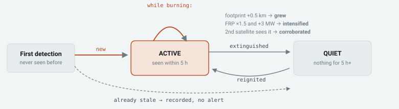
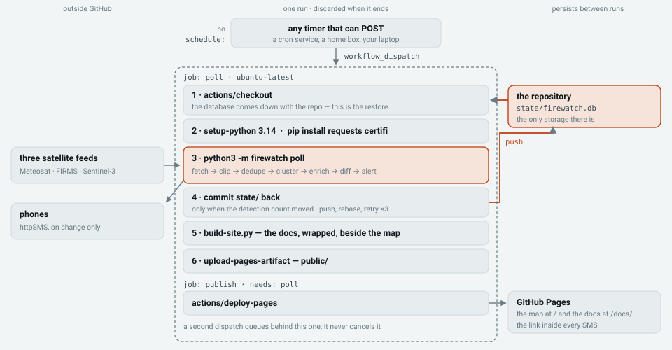

# FireWatch Bosna i Hercegovina

### 🔥 [Live map](https://mirza-basic.github.io/firewatch) · 📖 [Documentation](https://mirza-basic.github.io/firewatch/docs/)

Near-live wildfire monitoring for **all 145 municipalities of Bosnia and Herzegovina** —
roughly 51,200 km². Three satellite feeds, clustered into tracked fires, alerting by SMS
and a private Telegram channel per municipality, and a map that draws all 145 boundaries
and updates itself.

This branch is a different kind of change from either of the other two. `main` watches
one municipality and names it in the code; `fork-template` moves that one municipality
into a single file so it is trivial to re-point at another. This branch is neither a fixed
single place nor a template for one — it is all 145 at once, one instance, one process,
with per-municipality routing built in rather than left to a fork.

> ### Looking to watch just your own municipality? Start from [`fork-template`](../../tree/fork-template)
>
> That branch keeps the original single-place design, with the place moved out of the code
> and into `data/place.json`. Re-pointing it is `python3 -m firewatch setup "Općina Kakanj"`,
> not this branch's country-wide data model. **[FORK.md](../../blob/fork-template/FORK.md)**
> is the whole procedure.

## Why

A fire that starts in a forest at two in the morning is nobody's problem until somebody
sees smoke. Satellites see it sooner and the data is free — but the feeds are built to
archive fires, not to raise an alarm, and two delays stack up. The satellites sharp enough
to catch a small fire pass overhead only a few times a day. And being seen is not being
told: each observation has to be downlinked, processed into a fire product and published
before anything can poll it, which for NASA's feed takes about three hours.

Wait on that alone and a fire can reach you **eleven hours** after it started — an
overnight gap, then the processing. By then it is history, not a warning.


*3–4 September 2026, a fire 2.1 km south of Suha, recorded during this project's original
single-municipality deployment (Zavidovići — the town this system started in before it grew
to cover all 145); night is shaded. **Detection does not stop at sunset** — thermal infrared
needs no daylight. Meteosat caught this one at 18:40 UTC after dark, Sentinel-3 twice at
20:01, and VIIRS eleven times between 00:41 and 01:45 while it burned at 1.3–3.0 MW. The
single real gap is the 6 h 13 m before dawn: it lines up with the 04–07 UTC window in which
no polar satellite crosses this latitude, and Meteosat could not fill it because the fire
was well under its floor. None of this timing depends on which of the 145 municipalities is
watching — the same cadence and latency apply wherever in the country a fire is detected
now.*

End to end, that puts Meteosat about **39 minutes** behind ignition and FIRMS about
**200 minutes** at best — 11 hours at worst, when an overnight gap is followed by hours of
processing. The ~35-minute floor is EUMETSAT's publishing latency and nothing here can
improve on it; on the hosted copy a 10–15 minute trigger puts you **30–45 minutes** behind
the flame front. The point was never 35 minutes instead of 39. It is 35 instead of
eleven hours.

## What it does

Every cycle it fetches three feeds, keeps what falls inside the country (or within 2 km of
its border), folds the detections into tracked fire events, tags each with which
municipality (or two, for the deliberately overlapping Sarajevo/Istočno Sarajevo pair) it
falls inside, works out what changed, and tells you.

| Feed | Resolution | Cadence | Latency | Brings |
|---|---|---|---|---|
| Meteosat MTG FRP | ~4 km | **10 min** | ~25 min | continuity — it is watching at 3am |
| VIIRS + MODIS (FIRMS) | 375 m / 1 km | 4–7 / day | ~3 h | sensitivity to small fires |
| Sentinel-3 SLSTR FRP | 1 km | ~2 / day | 1–3 h | extra passes, corroboration |

They fail in opposite directions, which is the whole reason for carrying all three.
Meteosat never stops looking, but the weakest fire it has ever reported (measured during
the original single-municipality deployment — a sensor-floor characteristic that holds
wherever in the country a fire is now detected) is 4.4 MW, because a fire warms only the
part of a 4 km pixel it lands in; VIIRS has caught one of **0.19 MW** from 375 m, and is
usually somewhere else when you need it. Meteosat's night watch is not a figure of speech:
asked for one five-hour window of local solar night, it returned 1,951 detections over the
Persian Gulf's gas flares and 43 over wildfires in Iberia. Only Meteosat and Sentinel-3 need
no account at all.

Clustering is what makes an alert mean something: one fire produces one detection per
sensor, per overpass, per hot pixel, and one fire produced **45 detections from three
satellites over 30 hours**. Clustered, that is one event with a stable identity, a location
in words, and a history you can watch grow:

```
NOVI POZAR: 5.6 km I od Kamenice          fire, 5.6 km east of Kamenica
NIZAK 1.9/1.9MW                           severity, peak/latest radiative power
44.329,18.278                             coordinates that work with no signal
Vjetar 14km/h SI vlaga 38% rizik povisen  wind, humidity, spread risk
https://mirza-basic.github.io/firewatch   the live map
```

Alerts are written in Bosnian. SMS is transliterated to ASCII so it stays inside one
160-character segment — measured at at most 158 characters across every stored event and
alert kind. Telegram has no such budget (the limit is 4096, real alerts run 150–210), so it
keeps diacritics and carries lines SMS drops for cost — the detection count and its source
list, the footprint width, an `IZVAN BIH` marker for a fire in the buffer band outside the
country's own border. There is one private Telegram channel per municipality rather than
one fixed recipient list: a fire posts only to its own municipality's channel (or two,
for the Sarajevo/Istočno Sarajevo overlap), and subscribing means following that
municipality's own invite link, shown on its popup on the map.

**What it is not.** These are satellite *thermal anomalies*, not confirmed wildfires:
industrial heat, flares and agricultural burning all register, so verify before acting.
Cloud blocks every one of these sensors. Small fires are invisible to the fast feed. And
for a fire near people, a phone call still beats every satellite here by hours — this is
for the forest nobody is looking at.

## How it works

One fixed chain per cycle. Understanding it is most of understanding the codebase.



Two decisions in there drive everything else.

**Novelty is a property of the database, not a payload diff.** Every detection gets a
deterministic id from its source, sensor, rounded position and timestamp, and "what is
new" is whatever `INSERT OR IGNORE` actually inserted. A detection re-reported across
polls, or seen by two satellites, is only ever new once.

**Alerting operates on clustered events, never on raw detections.** Single linkage in
space and time, 3.5 km and 8 hours.



The radius is set by Meteosat's ~4 km pixel: tighten it below 3.5 km and one geostationary
fire splits into several events, each alerting separately. The colours are the point — one
fire arriving from three sensors at three resolutions, recognised as one thing.



| Alert | Trigger | |
|---|---|---|
| `new` | a fire never reported before | SMS + Telegram |
| `intensified` | peak power up ≥1.5× and ≥3 MW | SMS + Telegram |
| `grew` | more detections **and** footprint wider by ≥0.5 km | SMS + Telegram |
| `reignited` | a quiet event is producing detections again | SMS + Telegram |
| `corroborated` | a second independent satellite now sees it | Telegram only |
| `extinguished` | nothing for `quiet_hours` | Telegram only |

Each event and kind is rate-limited to one alert per 25 minutes. Telegram carries every
kind — there is no per-message cost to a channel post — but `extinguished` never reaches
SMS: it is a statement about the feed, not the forest, and does not need a text message
saying a satellite stopped seeing something.

`active` is one line of code and a claim about the data: the newest detection in the
cluster is younger than `quiet_hours` (5), recomputed every cycle so no status can get
stuck. It asserts that *a satellite still reports heat*, not that the fire is out — which
is why `extinguished` is silent on SMS. It is news about the feed, not about the forest.

## How it runs on GitHub

No server, no container, and no scheduler of GitHub's own. The production system is two
files in `.github/workflows/`, and (once deployed) this repository is the running instance.



Three things explain the shape of it:

**The repository is the disk.** A runner keeps nothing, so `state/firewatch.db` is
committed back each cycle. It carries the record of what has already been alerted on, so a
failed push is not cosmetic — the next run rediscovers the same fire and alerts on it
again. The commit is gated on the detection count, not the file's bytes, or every run
would add a fresh blob carrying nothing new.

**A Pages deploy replaces the whole site.** The map lives at `/` and the documentation is
built into `/docs/` in the same run, because a deploy carrying only the docs would take
the map — the URL inside every SMS — off the air.

**There is no `schedule:` block.** GitHub's cron has a five-minute floor and drifts 5–30
minutes under load, so an external timer calls the dispatch API instead, on whatever
cadence you choose. The cost is that GitHub can no longer tell you it stopped: if the
caller dies there is no failed run, just a map that quietly stops updating. Watch the
timestamp on the map, not the Actions tab.

**Deploying this branch replaces whatever is live at the same URL.** Pages serves whichever
run last deployed, regardless of source branch — dispatching this branch's `poll.yml` takes
over from `main`'s single-municipality map the moment it completes, real subscribers and
all. That is a one-way door worth being deliberate about, not something to trigger by
accident.

## Run it yourself

See it work first — no account, no key, no deployment, because two of the three feeds need
no credentials:

    git clone https://github.com/mirza-basic/firewatch.git
    cd firewatch
    git checkout bih-all-municipalities
    python3 -m pip install -r requirements.txt      # requests + certifi
    python3 -m firewatch poll                       # a real cycle, printed
    python3 -m firewatch map                        # opens the map it just built

To deploy it for real, set these repository secrets: `FIRMS_MAP_KEY`
([free, arrives in seconds](https://firms.modaps.eosdis.nasa.gov/api/map_key/), and
optional — without it the other two feeds carry the cycle), `HTTPSMS_API_KEY`
([your **account** key](https://httpsms.com/settings) — not the phone key the Android
gateway app signs in with), `HTTPSMS_FROM`, `FIREWATCH_SMS_TO` (recipients being a secret
because a public repo would publish the numbers), and `TELEGRAM_BOT_TOKEN` — the one
Telegram secret this branch needs, since which municipality has which channel is committed
data (`data/bih/municipalities.json`), not a secret. Set **Workflow permissions** to
read/write and **Pages source** to *GitHub Actions*, run `poll` once from the Actions tab,
then point a cron service at:

    POST https://api.github.com/repos/<you>/<repo>/actions/workflows/poll.yml/dispatches
    Authorization: Bearer <token>      # fine-grained PAT, Actions: read and write
    Accept: application/vnd.github+json

    {"ref":"bih-all-municipalities"}   # required: an empty body is 422, success is 204

The map URL is derived from `github.repository` at run time — no literal to edit, on this
branch or `fork-template`; only `main` still carries one.

Ten to fifteen minutes is the sweet spot; faster buys nothing against a feed that
publishes every ten. One caveat worth checking before you start: Meteosat sees roughly
**60°W to 60°E**. Bosnia and Herzegovina sits comfortably inside that arc — outside it,
everything still works, but you lose the fast feed and alerts arrive around three hours
late instead of forty minutes.

**Provisioning the 145 Telegram channels is a separate, one-time step**, done from your
own machine with a Telethon script (not part of this repository, since it needs a real
Telegram login) — the Bot API alone cannot create a channel or promote an admin. It is
rate-limited by Telegram in ways that are not fully predictable in advance (a flood-wait
has run anywhere from a couple of hours to over a day), so budget several sessions across
several days rather than one run. `python3 -m firewatch telegram-status` reports how many
of 145 are configured.

## Commands

    python3 -m firewatch poll [range]           one cycle + a printed report
    python3 -m firewatch status [range]         last published state
    python3 -m firewatch map                    rebuild and open the HTML map
    python3 -m firewatch backfill [days]        deep history fetch (default 30)
    python3 -m firewatch fire-danger [id]       today's FWI for one municipality, or all 145
    python3 -m firewatch telegram-status        how many of 145 have a channel
    python3 -m firewatch test-telegram <id>     post a sample alert to one municipality
    python3 -m firewatch quota                  FIRMS usage (a free call)
    python3 -m firewatch test-sms
    python3 tests_events.py                     clustering + alert-logic tests

`[range]` is `24h | 3d | 7d | 30d | 1y` — rolling windows over stored history, free of API
traffic but only as deep as what is stored, so run `backfill` once. Python 3.14 in CI.

## Branches

    main                    the original deployment: watches Zavidovići, names it in
                            config.py and both workflow files
    fork-template           the same single-place system with the place in one file
                            (data/place.json) — fork this one to watch your own town
    bih-all-municipalities  this branch: all 145 municipalities of Bosnia and Herzegovina
                            at once, one private Telegram channel per municipality

## Layout

    .github/workflows/  poll.yml (the cycle) · test-sms.yml · test-telegram.yml
                        (manual delivery checks)
    firewatch/          sources · geo · geo_bih · store · events · enrich · notify ·
                        sms · telegram · firedanger · mapgen · poller · config
    data/bih/           country boundary (OSM rel. 2528142) and buffer, all 145
                        municipality boundaries + settlements, municipalities.json
                        (the Telegram channel/invite mapping)
    deploy/             build-site.py, extract-diagrams.py, two feed probes,
                        and the container + host files this README does not cover
    docs/               the published documentation, and the README's diagrams
    state/              the committed database — on a runner, this is the disk

The diagrams above are extracted from the documentation pages by
`python3 deploy/extract-diagrams.py`, so the two cannot drift apart. No credential is
committed: every key comes from the environment, which is what a repository secret
becomes inside a run.

## License

[MIT](LICENSE) — fork it, run it, change it, no permission needed. Boundary and settlement
data © OpenStreetMap contributors under ODbL 1.0; detections courtesy of NASA FIRMS
(LANCE/ESDIS) and EUMETSAT; weather from Open-Meteo.
